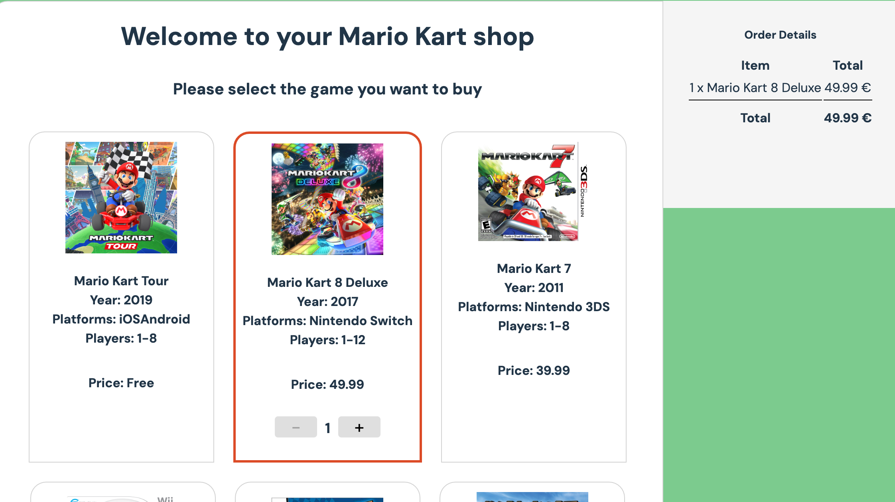

# Mario Kart Shop

This is a small React project designed to simulate a shop showcasing various Mario Kart games. The purpose of the project is to demonstrate React concepts like state management, component composition, and event handling.

## Features

- Displays a list of Mario Kart games with details such as year, platforms, number of players, and price.
- Allows users to select games to add to their bag.
- Users can adjust the quantity of games in their bag.
- Order details are dynamically updated based on selected items.

## How to Run the Project

To run this project locally, follow these steps:

1. Clone the repository:
   ```bash
   git clone <repository-url>
   ```

2. Navigate to the project directory:
   ```bash
   cd mario-kart-shop
   ```

3. Install dependencies:
   ```bash
   npm install
   ```

4. Start the development server using Vite:
   ```bash
   npm run dev

   or
   
   vite
   ```

5. Open your browser and visit:
   ```
   http://localhost:5173
   ```

## Project Structure

- **`App.js`**: Contains the main logic for managing state and rendering components.
- **`components/Item.jsx`**: Handles the display of individual games.
- **`components/OrderDetails.jsx`**: Displays the selected games in the shopping bag.

## Screenshots



---


